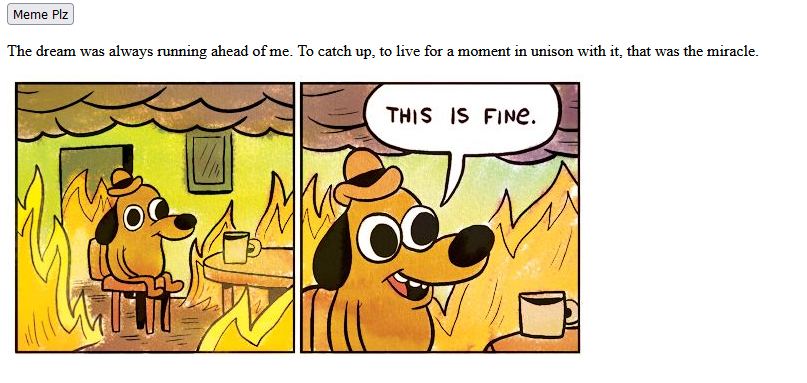

A simple meme generator using APIs. I wanted to make something that made me chuckle. with 7500 posibilities, there must be a funny somewhere.

[So here it is, a meme generator](https://hamsall.github.io/meme-generator/)

I've written [more over on medium](https://hamsall.medium.com/meme-generator-a-covid-project-38384170c9d) so check it out, leave a clap and some feedback. Keen to keep tinkering and making people chuckle

