# Introduction

This article is a study of a project to explore a customer's experience of tolls and see what we can improve. 
But before we jump in, a quick word on government products.

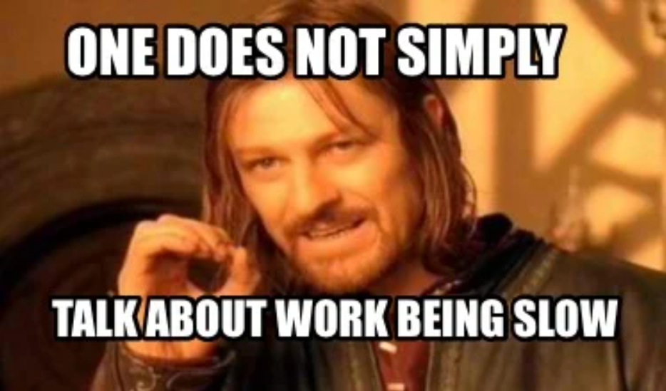

Product design in government agency is a methodical process.
There are uninformed decision makers to inspire, outdated policies and existing contracts to consider and legacy technology to work within.
So how can we drive product improvement within these constraints? 
A good story is a start.

# Discovery Phase

We began with a constrained research budget. This meant only had one shot at user testing.
We were also starting with a loose design brief so we needed information to deepen our understanding of the customer experience.

The team looked for samples of existing quantitative data. 
Our Product Manager discovered a large sample of quotes from Toll Relief customers.
The team decided we could use this data safely and build a better brief.

We delved into our spreadsheet and retrieved the quotes with our trusty thematic analysis tools.

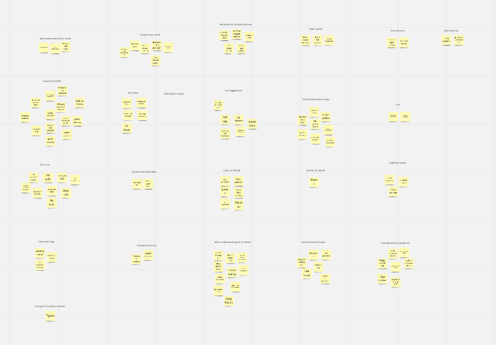

> We sorted 2200 quotes into about 100 themes. Generally they tackled the following areas: 
>
>1. Issues with Policy 
>2. Financial management
>3. Sentiment towards unique ideals
>4. The power of surprise
>5. Multiple vehicle issue
>6. Customer understanding 
>7. What functionality brought about bad Customer Experience (CX)
>8. What business rules brought about bad CX

This became the guide to our product strategy now and moving forward.

The biggest surprise from the data was the power of surprise! 

>Around 25% of customers who left a comment found out about Toll Relief while renewing their registration. 

This glow of surprise seemed to coat their entire renewal experience and all they could rave about in the comments was their surprise freebie! 

>50% had negative experiences which we were keen to improve.

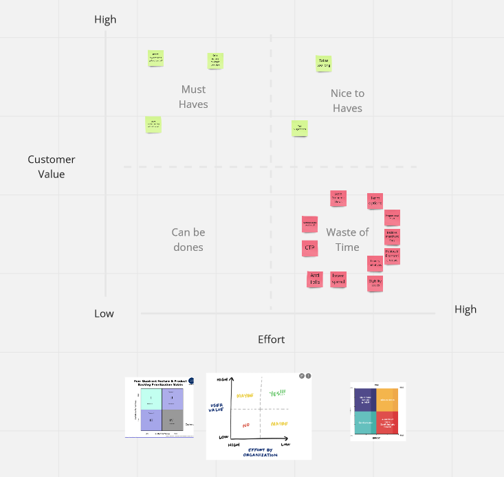

In Miro, the team sorted themes using a priority matrix. 
During scope workshops, we discovered what was in scope for the client and this project. 

>Things in scope became user stories ready for design.
>Anything out of scope was left in the archives of miro.

We learnt alot of hard truths when advocating for the customer experience.

>Our clients didn't want to prioritise this. The research helped them prepare for the future.

Sometimes the best we can do is establish solid evidence.
A benefit was the impact this had on our clients understanding of Toll Relief.

With this evidence, we now there is now a design foundation for new initiatives moving forward.
The winds of change will eventually blow in the favour of technical revolution for toll relief. When they do, we'll be prepared with a good story. It's just a shame we can't put the plan into action now.

# Define Phase

We began defining our design space in terms of UI accessibility and best practice.

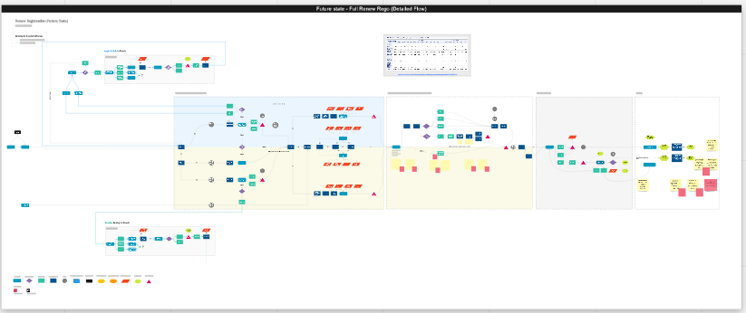

We used technical models to understand what functionality could and could not change. 

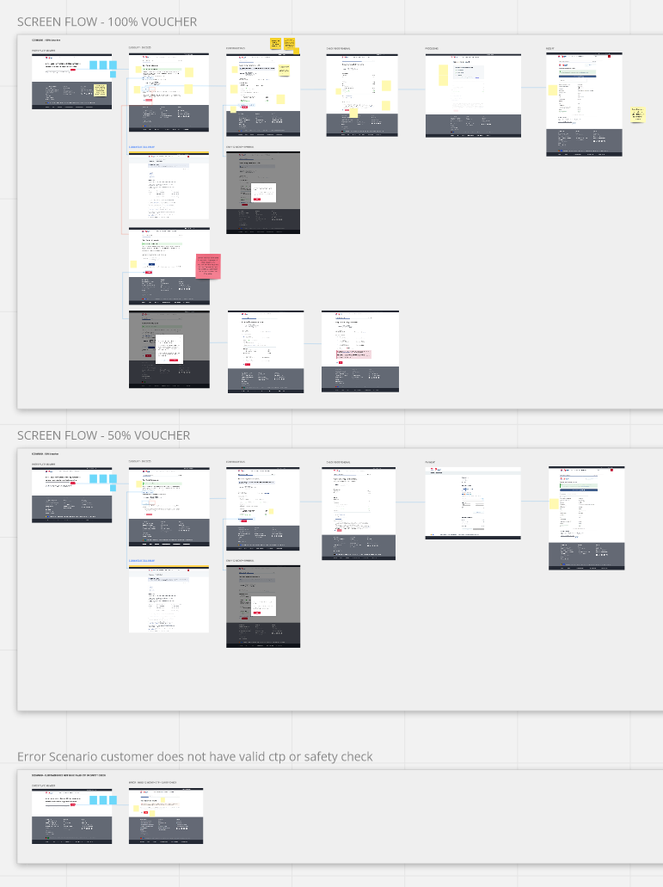

We created Customer flows to define the scope of our design space.

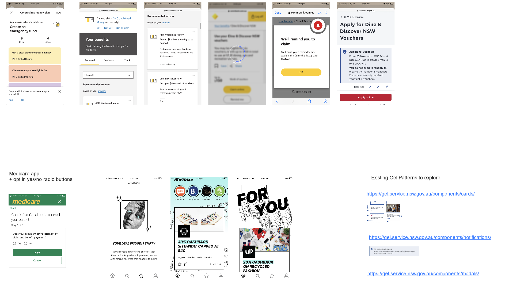

Best practice involved exploring what vouchers can feel like in digital products. 
We know we needed to balance engagement with our product with the existing services it sat within.

>We looked for something in the design system that would achieve the following.
>
>1. Briefly focus the customer on a task out of context
>2. Drive customers to begin applying their voucher
>3. Allow customers to continue their main task after application

We decided to internally A/B test a modal against an on-screen design.

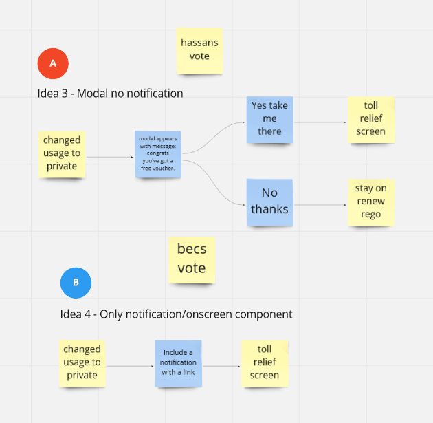

After design review with the wider team, we decided that both screens served a purpose and could be integrated at different touchpoints in the customer jourey. This became our our prototype guide.

# Develop Phase

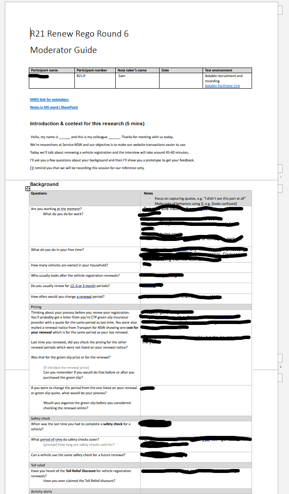

We created a moderater guide out of learning goals to measure the success of our prototype. We ran our product testing amongst other products. Moderator guides helped us as researcher to stay on track. 

Our component usability had been tested in previous research. We could focus the current tests on experience of the components in context. 

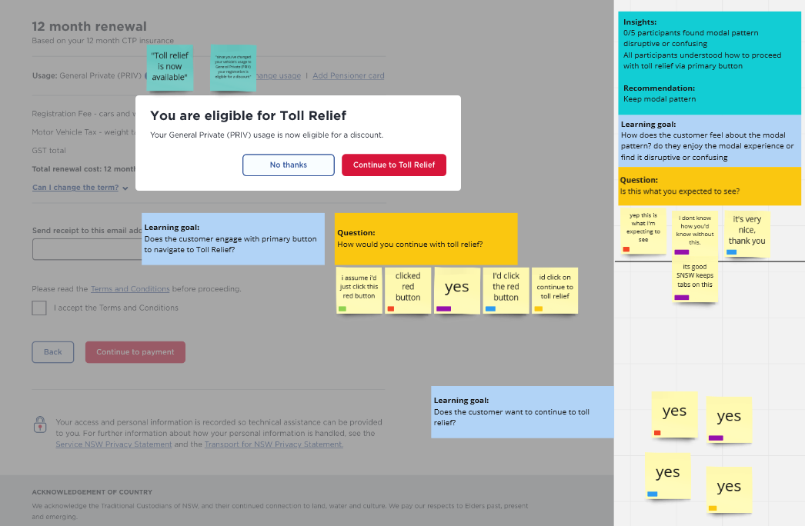

>5/5 Participants understood how the modal worked in toll relief context

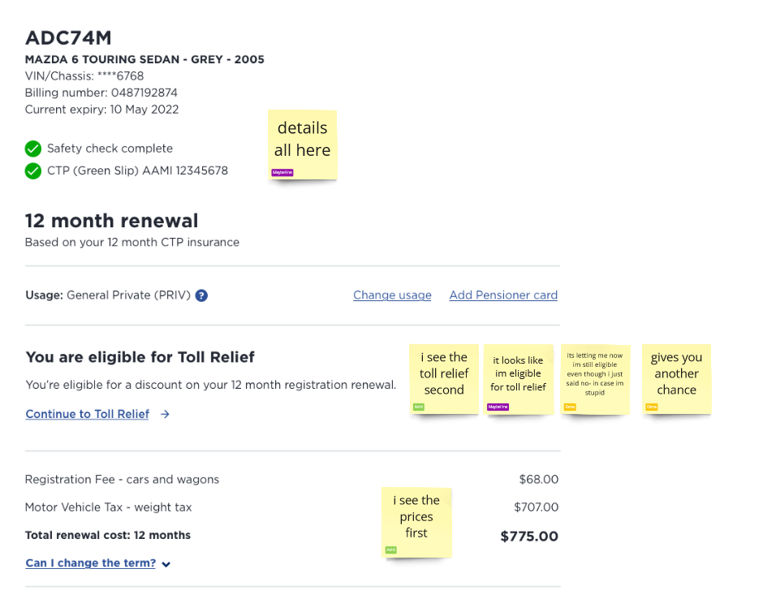

>5/5 Participants understood that the on-screen component was in case they skipped the modal. 

Some mentioned it was good in case you chagned your mind.

Our tests passed with flying colours. This is pretty rare in product design. Mostly you fail fast and often. We think it was thanks to Thematic Analysis. Our research made conversations with the client simple and turned a brief of mammoth scope into a small, manageable project that focused on quick wins.

# Deliver Phase

Our delivery phase was about explaining the research to the wider team, why it succeeded and how to build it. 

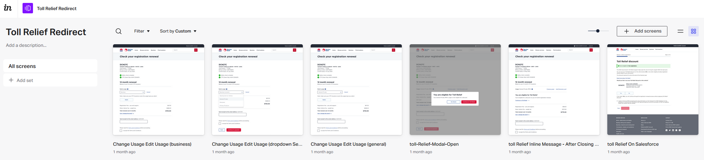

We used the interactive prototype from testing so the wider team could play around with it and understand the flow. [Check out the prototype here](https://servicensw.invisionapp.com/console/share/RCZM2N9BG7X)

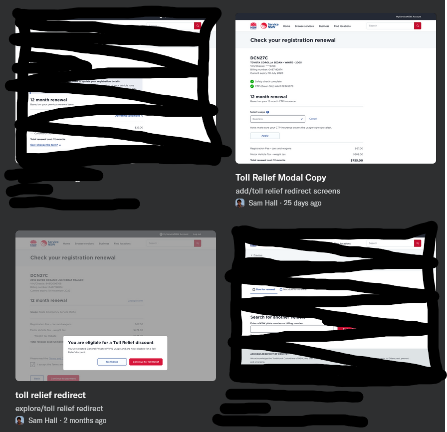

As a design source of truth, use had our screens in abstract collections. these were added to JIRA tickets to begin the conversation of building. 

Using JIRA this way is useful as it helps to integrate the tasks into the existing priorities of the development team. It's not as efficient as [Jake Knapp's design sprint](https://jakeknapp.com/sprint), but it is more flexible at maintaining progress across multiple unknowns in complex organisations.

Because of the large migration project underway this small project could slot in when the devs could handle it. 
When migration is complete, the conversations may turn towards what bigger dreams there are to tackle for the Toll Relief Product. It's comforting knowing that the research has given us a bigger story moving forward. The clients are excited about our research because they know the team can pick it up any time.

# The Team
 
Bec | Analyst

Craig | Product Manager

Hassan | Development

Libby | Design

Sam | Design

Vasu | Development